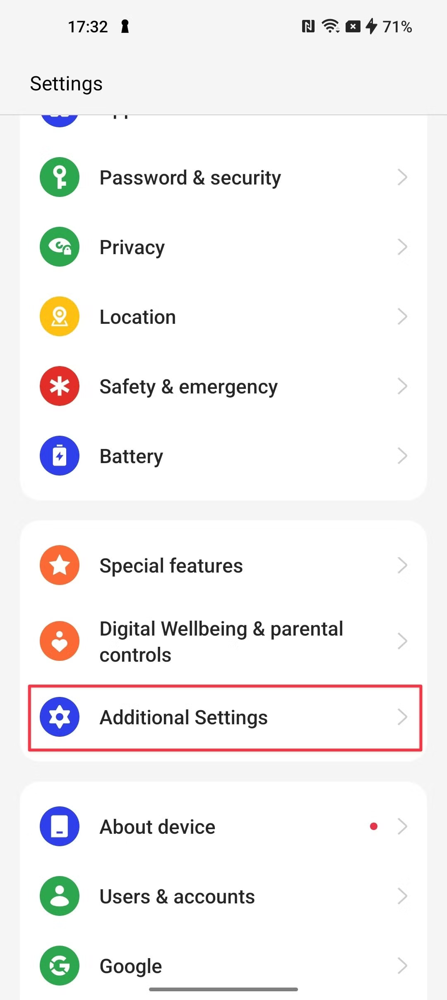
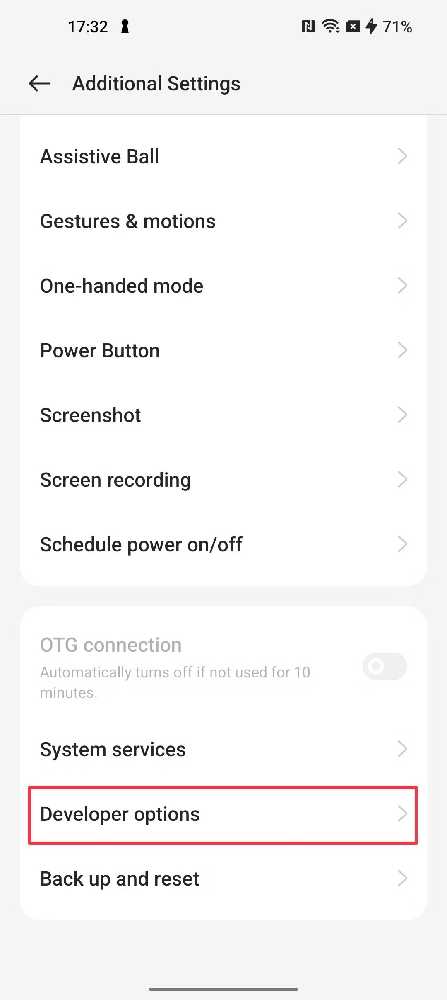
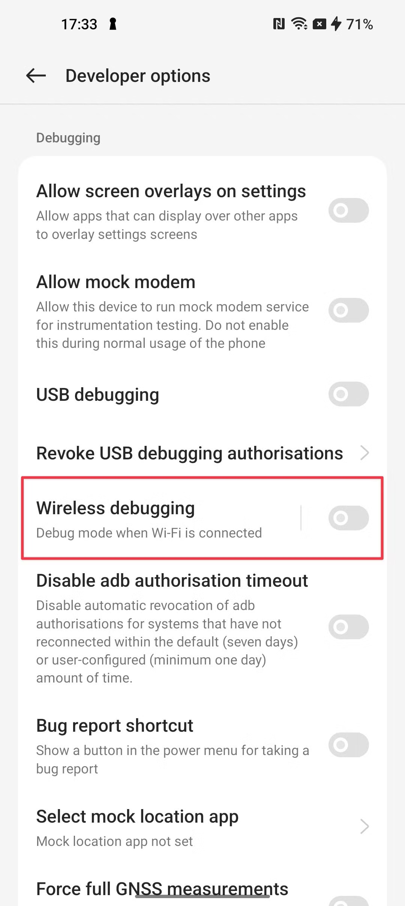
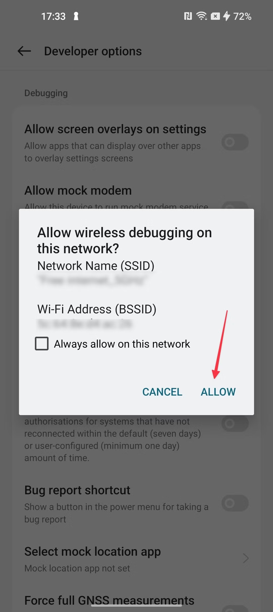
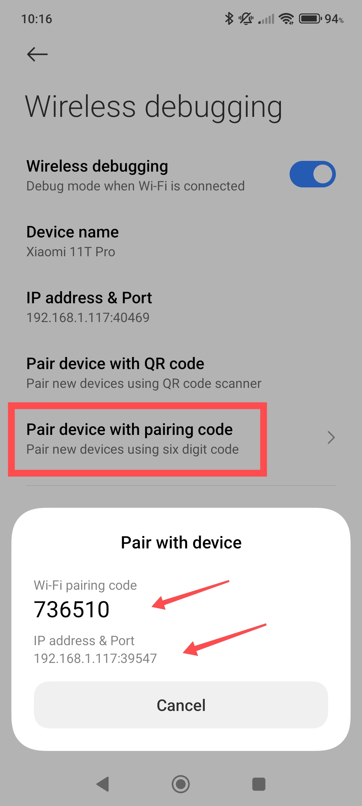
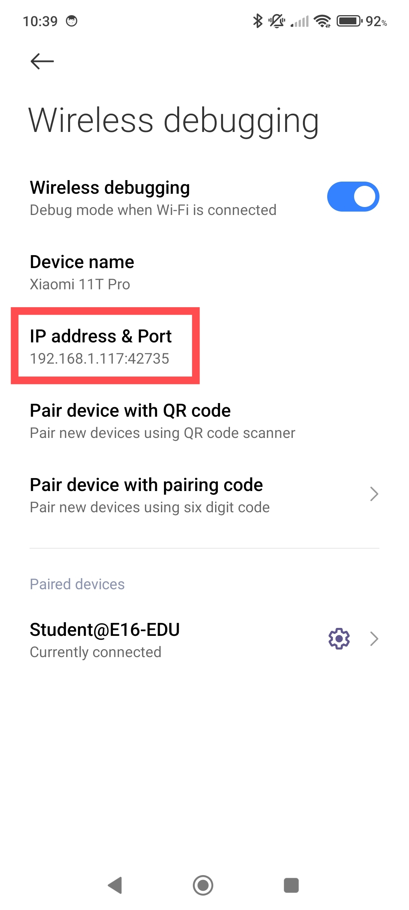
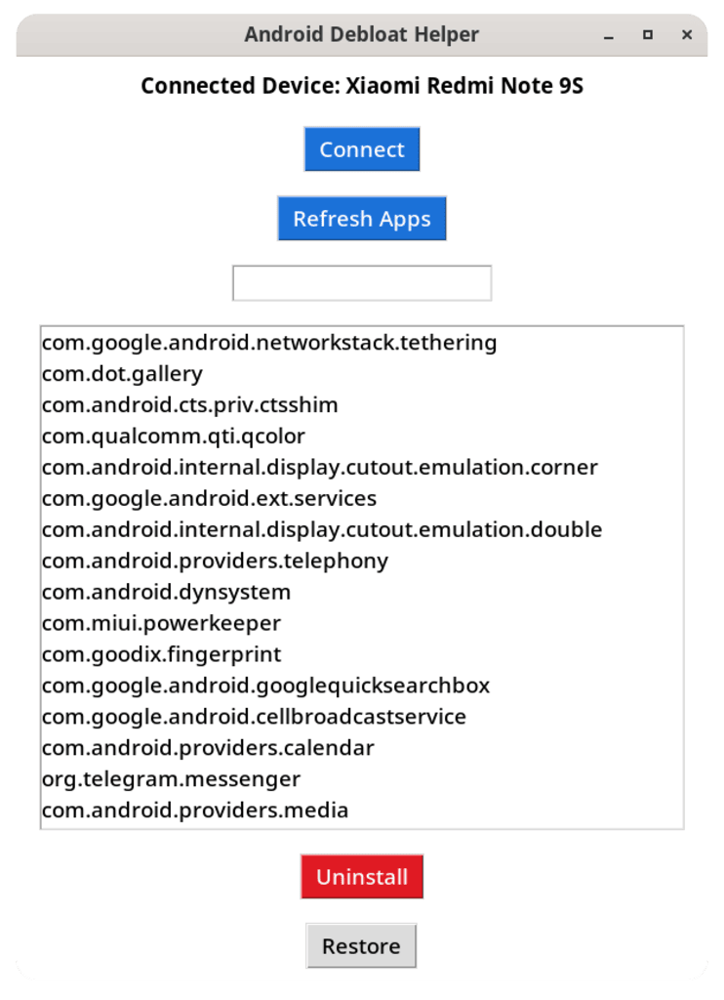

### 🪟 [Windows 11](#windows-11)
### 🤖 [Android Debloat Helper](#android-debloat-helper)
### ⚖️ [License & Terms](#license--terms)

---

### 🪟 Windows 11
Automate your Windows 11 setup with a clean, fast, fully scriptable workflow.
This repo provides ready-to-run commands for installing apps, configuring the system, and running remote scripts.
<br/><br/>

Run this PowerShell one-liner to install the latest Python 3.x and set up stable PATH shims:
```
$ErrorActionPreference='SilentlyContinue'; winget list --accept-source-agreements --accept-package-agreements | Out-Null; $out=winget search python.python 2>&1 | Out-String; $id=([regex]::Matches($out,'Python\.Python\.3\.(\d{2})')|Sort-Object{[int]$_.Groups[1].Value}-Descending|Select-Object -First 1).Value; if(-not $id){throw 'Python 3.x not found'}; winget install -e --id $id --override "InstallAllUsers=1 PrependPath=0 Include_launcher=1 InstallLauncherAllUsers=1" --accept-source-agreements --accept-package-agreements; $bin=Join-Path $env:LocalAppData 'bin'; New-Item -Type Directory $bin -Force|Out-Null; Set-Content (Join-Path $bin 'python.bat') "@echo off`r`npy -3 %*"; Set-Content (Join-Path $bin 'python3.bat') "@echo off`r`npy -3 %*"; Set-Content (Join-Path $bin 'pip.bat') "@echo off`r`npy -3 -m pip %*"; $u=([Environment]::GetEnvironmentVariable('Path','User') -split ';'|?{$_})|Select-Object -Unique; if(-not($u -contains $bin)){[Environment]::SetEnvironmentVariable('Path',(@($bin)+($u|?{$_ -ne $bin}) -join ';'),'User')}; $env:Path="$bin;$env:Path"
```
Dependencies:
```
python -m pip install --upgrade pip inquirer
```
Launch Winflow remotely:
```
Invoke-WebRequest -UseBasicParsing -Uri "https://raw.githubusercontent.com/dtvabrand/sysflow/refs/heads/main/winflow.py" | ForEach-Object { $_.Content } | py -3 -
```

### 🤖 Android Debloat Helper
Streamline your Android device by removing bloatware safely and efficiently.
This section provides quick commands to pair your device, enable debugging, and run the debloat helper script remotely.
<br/><br/>

- Enable developer options:
<div>
  
  
  
</div><br>

- Enable wireless debugging:
<div>
  
  
  
  
</div><br>

- 'Pair with device' _(only the first time)_:
```
adb pair <PHONE_IP>:<PAIRING_PORT>
```
- Connect using the 'IP address & Port' info _(every next time)_:
```
adb connect <PHONE_IP>:<ADB_PORT>
```

<div>
  
    
</div><br>

- Launch Android Debloat Helper remotely:
```
Invoke-WebRequest -Uri "https://raw.githubusercontent.com/cankurttekin/Android-Debloat-Helper-GUI/refs/heads/main/android-debloat-helper.py" | ForEach-Object { $_.Content } | python -
```

<div>
  
</div>

### License & Terms
- MIT license for all code in this repository.
- Third-party software installed via winget/msstore is subject to its own ToS/EULA.
- Credits: [Android Debloat Helper](https://github.com/cankurttekin/Android-Debloat-Helper-GUI) by @cankurttekin (GPL-3.0), executed remotely and not redistributed here.
- Windows and Microsoft are trademarks of Microsoft Corporation. This project is not affiliated with or endorsed by Microsoft.
